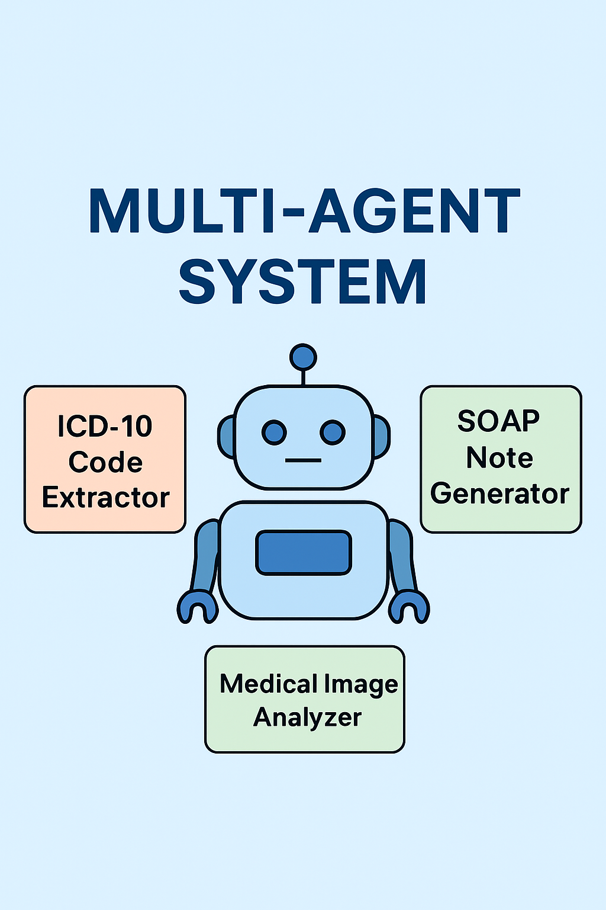
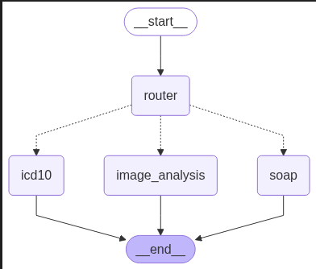
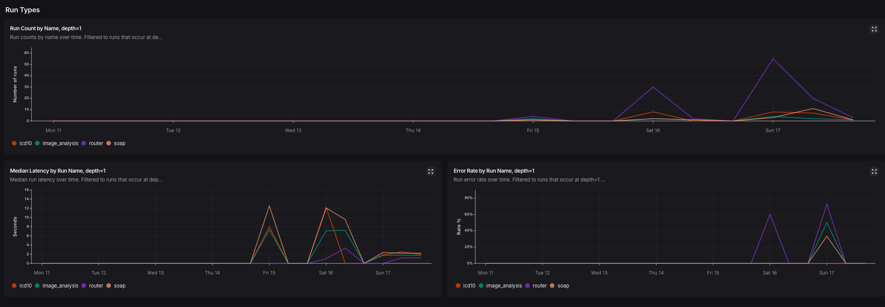

# 🏥 Multi-Agent Healthcare Assistant

This project is a modular FastAPI-based application designed to simulate a real-world clinical assistant powered by multiple AI agents. It supports clinical note analysis, medical image interpretation, and structured SOAP note generation — all powered by large language and vision models.


---

## 🚀 Features

- 🧠 **ICD-10 Code Extraction**  
  Extracts ICD-10 codes from free-text clinical notes using NLP models.

- 🖼️ **Medical Image Analysis**  
  Supports analysis of radiology images (X-ray, MRI, etc.) using multimodal models like MedGemma.

- 📋 **SOAP Note Generation**  
  Generates structured SOAP notes from raw clinical transcripts.

- 🧩 **Multi-Agent Architecture**  
  Built with modular agents for each task, easily extensible and integrated via `agentic_workflow.py`.

- 🔌 **FastAPI Backend**  
  Exposes an endpoint to upload both clinical text and medical images.

The user input goes through the router agent. The router agent analyzes the input, and routes the input to either icd10 code generation agent, soap generation agent or image analysis agent.

All the agents use MedGemma model as the LLM. The LLM is run locally. In order to reduce the latency of the app, a quantized model is used. 


Here is an architecture diagram:



---

## 🎬 Demo

Watch a quick demo of the Multi-Agent Medical System in action:

[<video src="artifacts/demo.mp4" controls width="600"></video>
](https://github.com/user-attachments/assets/d5451b68-ee10-4f70-8876-39fdf3886654)


---

## 📊 Monitoring


The app is monitored using LangSmith.



---
## 📝 Requirements

The current version of the app is using [mlx- version](https://huggingface.co/mlx-community/medgemma-4b-it-4bit) of medgemma model. The app is run locally on a machine with 48 GB RAM and Apple M4 Max chip. 

---

## 📦 Installation

### 1. Clone the repo

```bash
git clone https://github.com/joyceannie/Multi_Agent_Medical_System.git
cd Multi_Agent_Medical_System
```

### 2. Setup Python environment
```bash
python3.11 -m venv venv
source venv/bin/activate
pip install --upgrade pip
pip install -r requirements.txt
```

### 3. Setup .env file in the root directory with the following format
```bash
LANGSMITH_TRACING="true"
LANGSMITH_ENDPOINT="<your-langsmith-endpoint>"
LANGSMITH_API_KEY="your-langsmith-api-key"
LANGSMITH_PROJECT="your-langsmit-project"
```


### 4. Run the app
```
uvicorn app.main:app --reload
```

Goto http://localhost/8000 and interact with the app.


